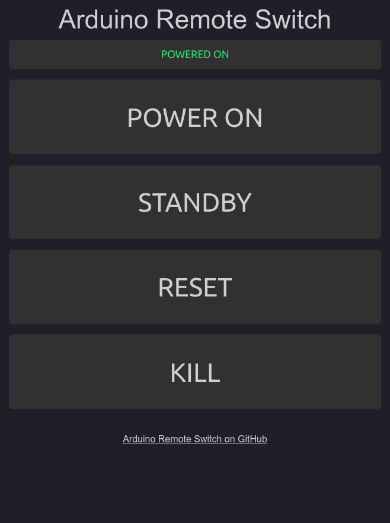

# Arduino Remote Switch [![ci][ci-img]][ci-url]

Remote switch to turn on, off, reset or kill PC via a web interface.

This project is based on a Arduino with a ethernet shield and a small daugtherboard to connect to PC headers by decoupling the two circuits with optocouplers. The power for the Arduino is sourced from the PC's motherboard USB header. The switch interface is hosted on the ethernet shield as a website and can be accessed from anywhere on the network via a webbrowser.

## Getting started

Check [what is needed](./docs/ToolsAndMaterials.md) and follow the [build instructions](./docs/BuildInstructions.md) to build this project.
