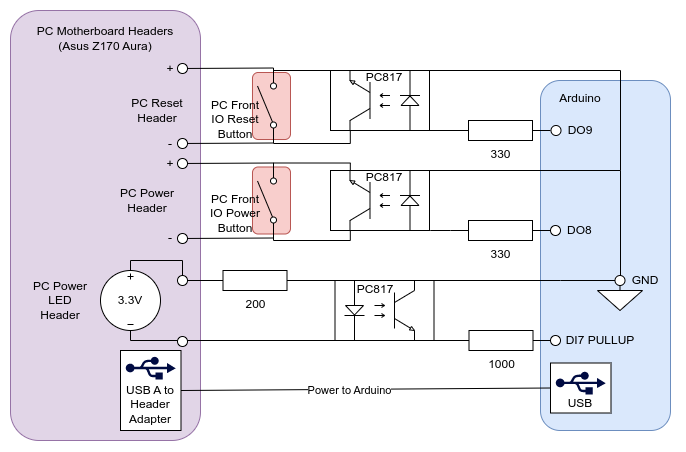
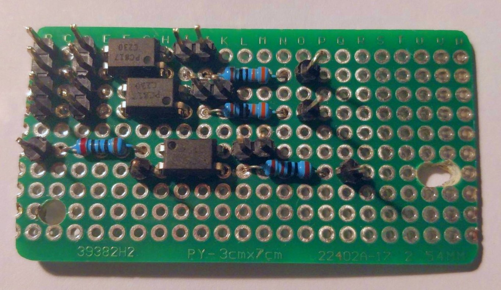
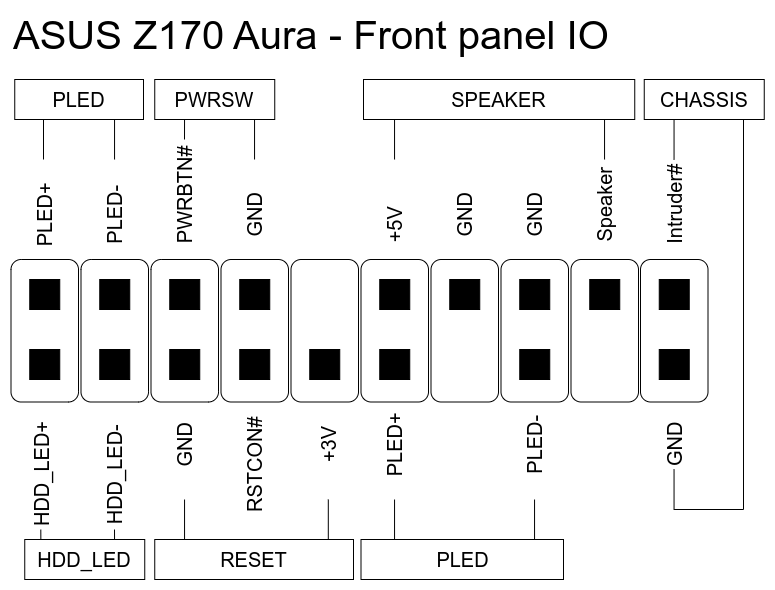

# Build instructions

> **Disclaimer:** Follow these instruction at your own risk.
>
> Also check your motherboard's manual for the available headers, since these might differ.

## Soldering and board installation

1. Cut PCB to the right size if necessary.
2. Drill two mounting holes into PCB to fit the board at the end of the case.
3. Solder the components onto PCB (daughter board).
4. Screw Arduino with shield and spacers into case (saw spacers to the right length in necessary).
5. Install daughter board.
6. Wire daughter board to Arduino.
7. Next steps: [install software](#installing-software).

## Installing software

### Installation steps

1. Deploy website on [SD card](#deploy-website-on-sd-card-default) or on [external webserver](#deploy-website-on-external-webserver-recommended)
2. Connect Arduino to a powered on PC via USB and the shield to a router via ethernet.
3. Open router configuration, set a static IP range and choose a free IP address.
4. Set the IP address in the `src.ino` file and save (skip this step when already done in a previous step).
5. Open Arduino IDE and upload `src.ino` to Arduino.
6. Test if the website can be reached by typing the IP into the web browser (skip this step when already done in a previous step).
7. Unplug all the cables from the Arduino for the next steps.
8. Next steps: [Install into PC](#installing-into-pc).

### Website deploy options

Website can be deployed on SD card of the ethernet shield or on a dedicated webserver.

Recommended way is to deploy the website on a dedicated webserver due to problems with the SD card initialization. Sometimes the SD card does not initialize on startup, pulling the SD card out and pushing it in again helps. But this is not a viable solution when the arduino is installed inside a PC.

#### Deploy website on SD card (default)

1. Format SD card to FAT16 with [SDcard formatter (recommended)](https://www.sdcard.org/downloads/formatter/)
2. Store website (content of `web/src/`) on SD card.
3. Put SD card into ethernet shield.

#### Deploy website on external webserver (recommended)

1. In `server/src/src.ino`

- Comment out `#define WEBSITE_ON_SD_CARD`
- Comment in `#define WEBSITE_ON_EXTERNAL_WEBSERVER`
- Set the IP address in the `src.ino` file and save.

2. In `web/src/index.htm`

- Set the `URL` constant to the IP address of the arduino ethernet shield

3. Deploy the webserver using docker

- docker build -t remote-switch .
- docker run -p 80:80 remote-switch

4. Test if the website can be reached by typing the IP into the web browser.

## Installing into PC

1. Turn off Arduino and PC and detach from power.
2. Install USB internal header on the PC's motherboard. See your motherboard manual for a free USB header.
3. Wire cables between your PC and Arduino like following and close the case.
4. Connect Arduino to the USB header.
5. Connect the shield to ethernet to router.
6. Restore power to PC again. Arduino should turn on.
7. Open web browser on phone to open the website and turn on PC by pressing the power on button.
8. PC should start.

